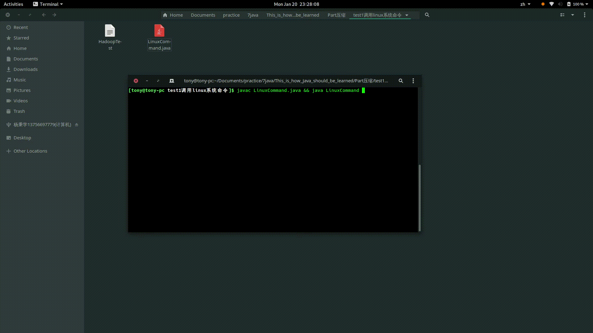
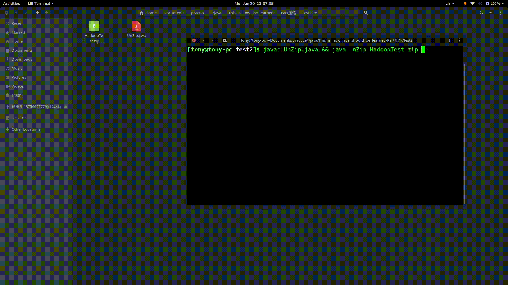
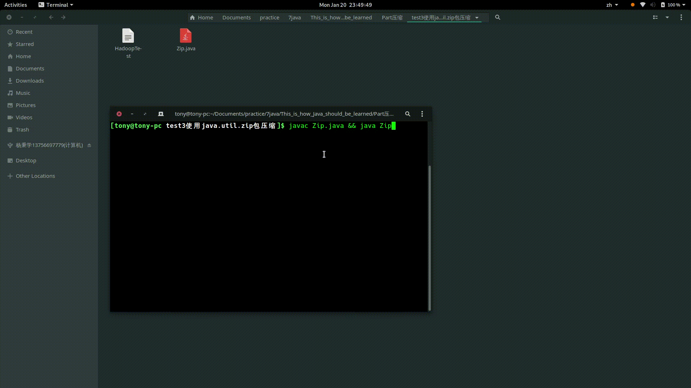
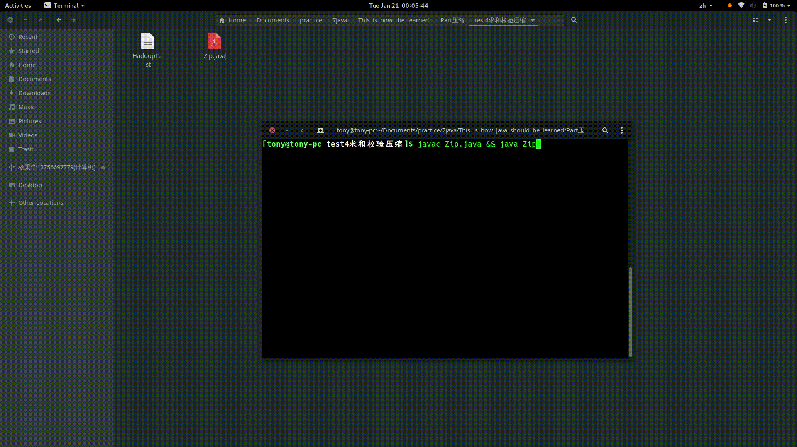
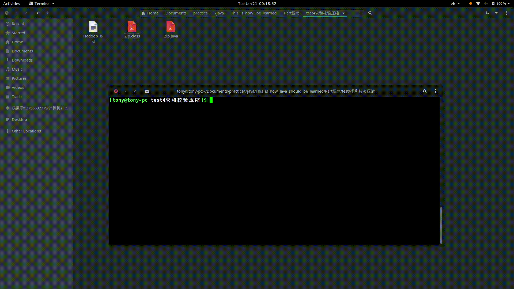
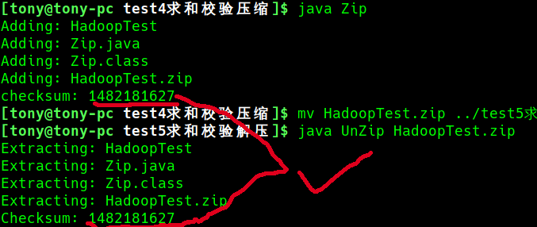

# 压缩算法
### 方法一：调用Linux自带命令
首先我们是可以调用电脑自带的 rar， WinZip，gzip等工具实现压缩

### 方法二：使用java.util.zip包
条目 |	类型 |	描述
:-:|:-:|:-:
Checksum |接口 |被类Adler32和CRC32实现的接口
Adler32 |	类 |	使用Alder32算法来计算Checksum数目
CheckedInputStream |	类 	|一个输入流，保存着被读取数据的Checksum
CheckedOutputStream |	类 |	一个输出流，保存着被读取数据的Checksum
CRC32 |	类 |	使用CRC32算法来计算Checksum数目
Deflater |	类 	|使用ZLIB压缩类，支持通常的压缩方式
DeflaterOutputStream |	类 |	一个输出过滤流，用来压缩Deflater格式数据
GZIPInputStream |	类 |	一个输入过滤流，读取GZIP格式压缩数据
GZIPOutputStream |	类 |	一个输出过滤流，读取GZIP格式压缩数据
Inflater |	类 	|使用ZLIB压缩类，支持通常的解压方式
InlfaterInputStream |	类 |	一个输入过滤流，用来解压Inlfater格式的压缩数据
ZipEntry |	类 |	存储ZIP条目
ZipFile |	类 	|从ZIP文件中读取ZIP条目
ZipInputStream |	类 |	一个输入过滤流，用来读取ZIP格式文件中的文件
ZipOutputStream |	类 |	一个输出过滤流，用来向ZIP格式文件口写入文件
DataFormatException |	异常类 |	抛出一个数据格式错误
ZipException 	|异常类 	|抛出一个ZIP文件

> 类ZipEntry描述了存储在ZIP文件中的压缩文件。类中包含有多种方法可以用来设置和获得ZIP条目的信息。类ZipEntry是被 ZipFile和ZipInputStream使用来读取ZIP文件，ZipOutputStream来写入ZIP文件的。

> **求和校验**:ava.util.zip包中 Adler32 和 CRC32，它们实现了java.util.zip.Checksum接 口，并估算了压缩数据的校验和（checksum）。众所周知，在运算速度方面，Adler32算法比CRC32算法要有一定的优势；但在数据可信度方 面，CRC32算法则要更胜一筹。

#### 1.解压Zip文件

#### 2.压缩Zip文件

> **注意**:条目列表可以以两种方式加入ZIP文件中，一种是压缩方式（DEFLATED），另一种是不压缩方式(STORED),系统默认的存储方式为压缩方式 （DEFLATED）。SetMethod方法可以用来设置它的存储方式。例如，设置存储方式为DEFLATED（压缩）应该这样做： out.setMethod(ZipOutputStream.DEFLATED) 设置存储方式为（不压缩）应该这样做： out.setMethod(ZipOutputStream.STORED)。

#### 3.校验传输
> 这里需要强调一下之所以加上校验的原因是我本人觉得如果网络传输在Socket中如果传输Hadoop大文件可能存在丢包的风险，所以加上校验

